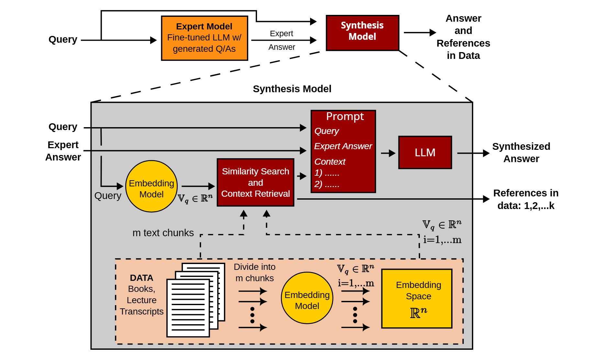

# AI University: Finite Element Method
This repository, part of the [AI University (AI-U)](https://my-ai-university.com) initiative, demonstrates the AI-U framework via a graduate-level Finite Element Method (FEM) case study, providing scripts, notebooks, configurations, and raw data for data generation, model fine-tuning, and workflow evaluation.

### Overview

We fine-tune a large language model (LLM) using LoRA to create an expert model that responds in the instructor's style. User queries are first answered by this expert model. The expert's response and original user query are then passed to a synthesis model, which retrieves relevant context from course materials using RAG and integrates this context with the expert’s response via an LLM guided by a system prompt, generating an enhanced answer.

### Highlights
- Scalable AI-driven pipeline to generate fine-tuning data, verified by domain experts
- A workflow in which a fine-tuned expert model, **LLaMA-TOMMI-1.0**, feeds into a RAG-based synthesis model, enabling adaptable updates and course-style responses with references
- Web prototype linking AI responses to relevant materials and video timestamps
- Fully open-source stack enabling local deployment and minimizing data privacy risks

### Resources
- ArXiv preprint: *[link coming soon]*
- Interactive prototype: [https://huggingface.co/spaces/my-ai-university/finite-element-method](https://huggingface.co/spaces/my-ai-university/finite-element-method)
- HuggingFace: [https://huggingface.co/my-ai-university](https://huggingface.co/my-ai-university)
- Weights & Biases (wandb): [https://wandb.ai/my-ai-university/finite-element-method](https://wandb.ai/my-ai-university/finite-element-method)

### Main Data Sources
- [Introduction to Finite Element Methods (FEM) by Prof. Krishna Garikipati](https://www.youtube.com/playlist?list=PLJhG_d-Sp_JHKVRhfTgDqbic_4MHpltXZ)
- [The Finite Element Method: Linear Static and Dynamic Finite Element Analysis by Thomas J. R. Hughes](https://www.google.com/books/edition/_/cHH2n_qBK0IC?hl=en)

### Citation *[will be updated]*
```bibtex
@misc{aiu2025fem,
  title={AI University: An LLM-based platform for instructional alignment to scientific classrooms},
  author={Mostafa Faghih Shojaei and Rahul Gulati and Benjamin A. Jasperson and Shangshang Wang and Simone Cimolato and Dangli Cao and Willie Neiswanger and Krishna Garikipati},
  year={2025},
  archivePrefix={arXiv},
  eprint={2404.xxxxx},
  primaryClass={cs.CL}
}
```


